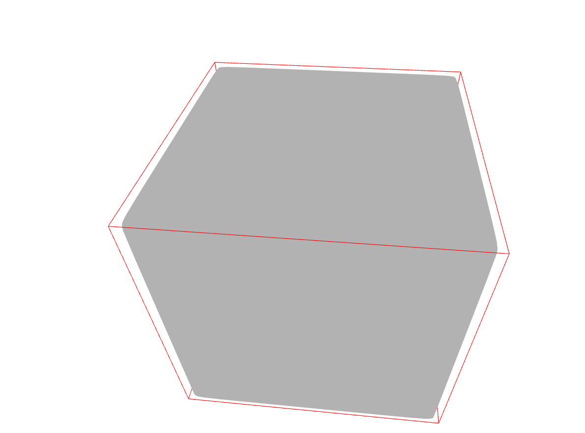
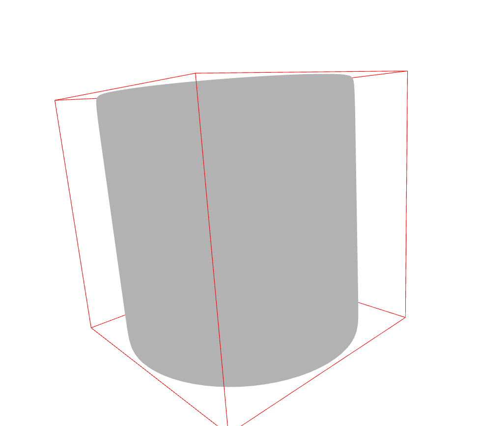
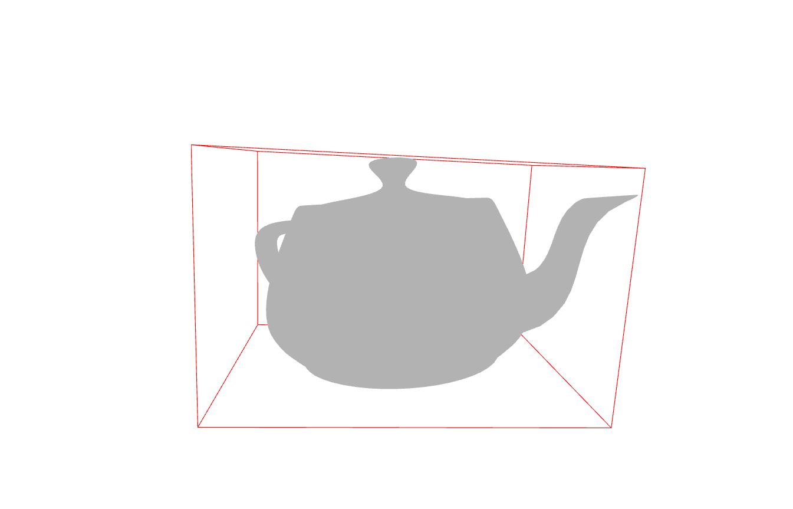
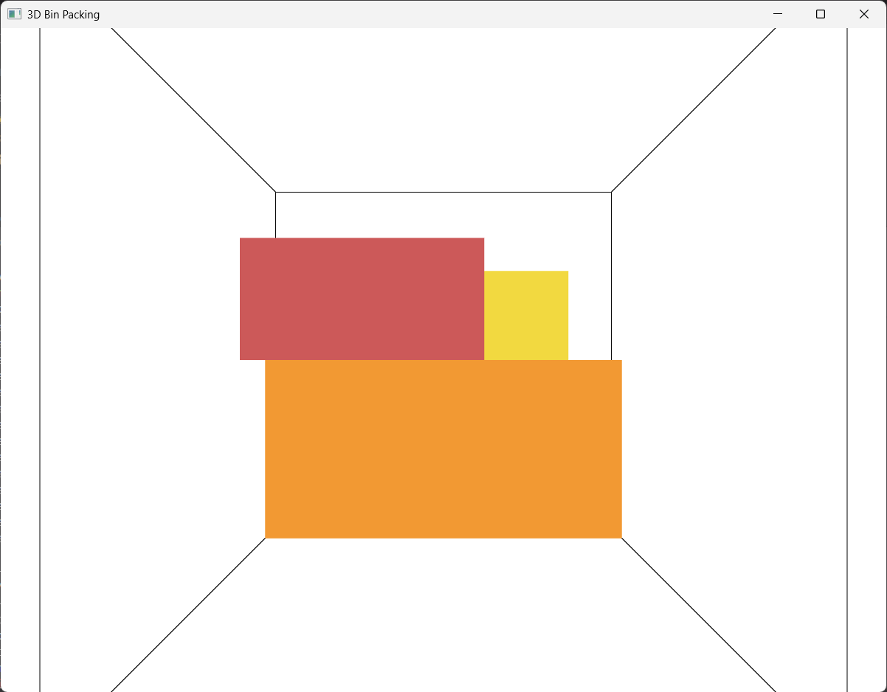
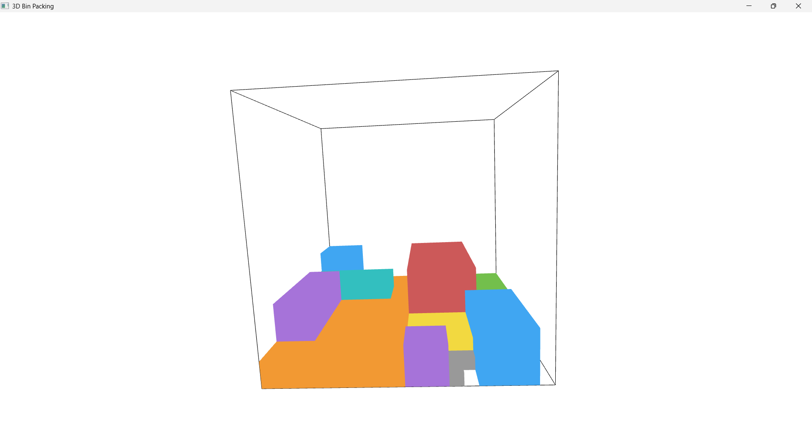

# Computer Vision / AI Engineer Assignment

## Introduction

This repository contains my solutions for the Computer Vision / AI Engineer assignment. The assignment is divided into two independent problems that address different aspects of three-dimensional geometry and spatial reasoning.

The first problem focuses on geometric analysis, where the objective is to compute the minimum Oriented Bounding Box(OBB) of a three-dimensional object represented as a mesh. Unlike an Axis-Aligned Bounding Box(AABB), an oriented bounding box rotates with the object and provides a tighter approximation of its occupied space, making it significantly more useful for measuring real-world objects.

The second problem focuses on spatial planning. Given a collection of rectangular items and a fixed-size container, the objective is to determine valid placement coordinates for every item while satisfying practical packing constraints such as collision avoidance, boundary limits, and gravity support.

Throughout both parts of the assignment, my primary objective was not only to produce correct outputs, but also to design solutions that are deterministic, modular, maintainable, and easy to understand. Rather than pursuing unnecessary algorithmic complexity, I focused on implementing solutions that satisfy the assignment requirements while following sound software engineering practices.

## Problem Analysis

The assignment consists of two independent problems that require different solution strategies. Although both involve three-dimensional geometry, they address different engineering objectives. The first problem focuses on geometric analysis, where the objective is to compute an oriented bounding box for a three-dimensional object. The second problem focuses on spatial planning, where multiple objects must be arranged inside a container while satisfying geometric and physical constraints.

For the first problem, the assignment explicitly requires an **Oriented Bounding Box (OBB)** rather than an **Axis-Aligned Bounding Box (AABB)**. An AABB is constrained to the global coordinate axes and often contains a significant amount of unused space when the object is rotated. An OBB aligns with the orientation of the object itself, producing a tighter enclosure and more accurate measurements of its dimensions and volume. Therefore, the implementation centers around computing the Minimum Oriented Bounding Box provided by Open3D.

The second problem is fundamentally different. It is not simply a collision detection task, but a constrained placement problem. A valid solution must ensure that every item remains within the container boundaries, that no two items overlap, and that every placed item is physically supported either by the container floor or by previously placed items. In addition to satisfying these constraints, the assignment encourages compact packing without requiring a mathematically optimal arrangement.

These observations naturally lead to different implementation strategies. The first problem relies on established geometric algorithms for accurate measurement, while the second requires a placement algorithm that incrementally constructs a valid packing configuration by enforcing boundary, collision, and support constraints at every step.

# Part 1 – 3D Oriented Bounding Box

## Objective

The objective of the first part of the assignment is to determine the minimum oriented bounding box for a given three-dimensional mesh. Three different input models—Cube, Cylinder, and Teapot—are provided in `.obj` format. For each model, the implementation is required to compute an Oriented Bounding Box (OBB), report its dimensions and volume, and visualize the resulting bounding box together with the original object.

Unlike an Axis-Aligned Bounding Box (AABB), which is always aligned with the global coordinate system, an OBB rotates with the object. This produces a tighter enclosure and provides measurements that more accurately represent the physical dimensions of the object.

## Solution Approach

The implementation is built using the Open3D library, which provides robust support for loading, processing, and visualizing three-dimensional geometry. Each input mesh is read from disk and converted into an Open3D mesh object. The Minimum Oriented Bounding Box is then computed directly from the mesh geometry using Open3D's geometric utilities.

Once the bounding box is computed, the implementation extracts the box dimensions and calculates its volume. Finally, both the original mesh and the computed bounding box are rendered together, allowing the correctness of the result to be visually verified for each input object.

The implementation is intentionally modular. Responsibilities such as file loading, bounding box computation, visualization, and command-line execution are separated into independent components. This improves readability, simplifies future modifications, and makes each component easier to test and maintain.

## PCA-Based Comparison

In addition to the Minimum Oriented Bounding Box, a Principal Component Analysis (PCA)-based bounding box was also implemented for comparison.

PCA estimates the dominant directions of an object's geometry by analyzing the distribution of its vertices. While this often produces a reasonable approximation of the object's orientation, the resulting bounding box is not guaranteed to have the minimum possible volume. Consequently, the PCA-based solution was retained as a reference implementation, while the Minimum Oriented Bounding Box computed by Open3D was used as the primary solution because it satisfies the assignment objective of obtaining the tightest possible bounding box.

## Results

The implementation was evaluated using the three mesh models provided in the assignment: **Cube**, **Cylinder**, and **Teapot**. For each input mesh, the script successfully computed the Minimum Oriented Bounding Box, reported its dimensions and volume, and visualized the bounding box together with the original mesh.

The figures below illustrate the computed Oriented Bounding Boxes for each object.

### Cube

<p align="center">
  
</p>

*Figure 1. Minimum Oriented Bounding Box computed for the Cube model.*

---

### Cylinder

<p align="center">
  
</p>

*Figure 2. Minimum Oriented Bounding Box computed for the Cylinder model.*

---

### Teapot

<p align="center">
  
</p>

*Figure 3. Minimum Oriented Bounding Box computed for the Teapot model.*

The visualizations demonstrate that the computed bounding boxes align with the orientation of the objects instead of the global coordinate axes. This produces a tighter enclosure than an Axis-Aligned Bounding Box (AABB) and provides more representative measurements of the object's dimensions and occupied volume.

# Part 2 – 3D Bin Packing

## Problem Overview

The second part of the assignment addresses a constrained three-dimensional packing problem. A list of twenty rectangular items, each with predefined dimensions, must be placed inside a master container of size **100 × 100 × 100**. Unlike a simple visualization task, the placement process must satisfy several geometric and physical constraints while attempting to utilize the available space efficiently.

Three constraints govern every placement:

- Every item must remain completely within the container boundaries.
- No two items may overlap.
- Every item must be physically supported either by the container floor or by another previously placed item.

These constraints make the problem significantly more challenging than simply assigning coordinates to each object. Every placement decision influences the remaining available space and determines which future placements remain feasible. Consequently, a valid solution must continuously verify that every new item satisfies all constraints before it becomes part of the final packing configuration.

The assignment also encourages compact packing by stating that items should be packed as tightly as possible. However, it does not require a mathematically optimal solution. Achieving globally optimal three-dimensional packing is a computationally expensive optimization problem and is well beyond the scope of the assignment. Therefore, the implementation focuses on producing a deterministic, valid, and maintainable solution that consistently satisfies every required constraint while achieving efficient space utilization.

## Solution Strategy

Several approaches can be used to solve a three-dimensional bin packing problem, ranging from exhaustive search and backtracking algorithms to advanced optimization techniques such as branch-and-bound, genetic algorithms, and simulated annealing. While these methods can often produce better packing arrangements, they also introduce significantly higher computational complexity and implementation overhead.

The objective of this assignment is different. Rather than finding the globally optimal arrangement, the primary requirement is to generate a valid packing configuration that satisfies all geometric and physical constraints while attempting to utilize the available space efficiently. This makes a constructive heuristic an appropriate choice for the problem.

The implemented solution follows a deterministic constructive approach, where items are placed one at a time while continuously validating every placement. Once an item is successfully placed, it becomes part of the current packing configuration and is not repositioned later. This incremental strategy keeps the implementation straightforward, predictable, and easy to verify, while consistently producing valid packing results for the provided dataset.

To improve placement quality without introducing unnecessary complexity, the implementation incorporates several lightweight heuristics. Every item is evaluated in all of its unique orientations, allowing the algorithm to consider multiple possible placements. The generated orientations are then ordered by prioritizing lower heights followed by larger base footprints. This ordering encourages flatter placements, creating more stable support surfaces and preserving usable vertical space for subsequent items.

Instead of searching every possible coordinate inside the container, the algorithm maintains a dynamic set of candidate positions. The search begins at the origin, and every successful placement generates new candidate locations immediately to the right, in front of, and above the placed item. Restricting the search to these meaningful positions significantly reduces the number of placement evaluations while still allowing the packing process to expand naturally throughout the container.

Throughout the packing process, every candidate placement is validated using three independent checks. The algorithm first verifies that the item remains completely within the container boundaries, then ensures that it does not intersect any previously placed item, and finally confirms that the item is physically supported either by the container floor or by existing items. Only placements satisfying all three conditions are accepted.

This combination of deterministic placement, orientation heuristics, candidate position expansion, and incremental constraint validation results in a solution that satisfies every assignment requirement while remaining modular, maintainable, and easy to understand.

## Packing Workflow

The packing process follows a deterministic sequence of validation steps to ensure that every placement satisfies the assignment constraints.

1. Load the item dimensions and metadata from the provided JSON file.
2. Generate all unique orientations for each item and sort them using the implemented orientation heuristic.
3. Initialize the packing process with the origin as the first candidate position.
4. For each item, evaluate every candidate position and orientation combination.
5. Validate each placement by checking:
   - Container boundary constraints
   - Collision with previously placed items
   - Physical support (gravity)
6. Accept the first valid placement and update the list of candidate positions by adding locations to the right, in front of, and above the newly placed item.
7. Repeat the process until every item has been successfully placed.

This workflow ensures that every accepted placement maintains a valid packing configuration while keeping the search process deterministic and computationally manageable.

## Results

The implementation successfully packs all **20** items provided in the assignment while satisfying every required constraint.

The final packing achieves the following:

- All 20 items are successfully placed inside the master container.
- No items overlap.
- No item extends beyond the container boundaries.
- Every item is fully supported by either the container floor or previously placed items.
- The packing process is deterministic, producing consistent results across repeated executions.
- The complete packing sequence is visualized using Open3D through an animated placement of the items.

### Packing Animation

<p align="center">
  
</p>

*Figure 4. Intermediate stage of the packing process.*

---

### Final Packing Configuration

<p align="center">
  
</p>

*Figure 5. Final arrangement of all 20 items inside the master container.*

## Conclusion

This assignment demonstrates two complementary aspects of three-dimensional computational geometry: geometric measurement through oriented bounding boxes and constrained spatial planning through heuristic-based bin packing. The implemented solutions emphasize correctness, deterministic behavior, and maintainable software design while satisfying all functional requirements of the assignment.

# Running the Project

## Clone the Repository

Clone the repository to your local machine.

```bash
git clone https://github.com/Arun04Hack/computer-vision-ai-assignment.git
cd computer-vision-ai-assignment
```

## Install Dependencies

Create a virtual environment (recommended) and install the required dependency.

```bash
python -m venv venv
```

### Windows

```bash
venv\Scripts\activate
```

### Linux / macOS

```bash
source venv/bin/activate
```

Install the required package:

```bash
pip install -r requirements.txt
```

---

# Running Part 1 – 3D Oriented Bounding Box

Navigate to the task_1 directory.

```bash
cd task_1
```

The implementation accepts the mesh file as a command-line argument, allowing different input models to be processed without modifying the source code.

### Minimal OBB

```bash
python main.py data/CUBE.obj data/CYLINDER.obj data/TEAPOT.obj
```

### Visualize

```bash
python main.py data/CUBE.obj data/CYLINDER.obj data/TEAPOT.obj -v
python main.py data/CUBE.obj data/CYLINDER.obj data/TEAPOT.obj --visualize
```

### Compare PCA and Minimal

```bash
python main.py data/CUBE.obj data/CYLINDER.obj data/TEAPOT.obj --compare
python main.py data/CUBE.obj data/CYLINDER.obj data/TEAPOT.obj -c
```
---

# Running Part 2 – 3D Bin Packing

Navigate to the task_2 directory.

```bash
cd task_2
```

Run the packing script by providing the item list as a command-line argument.

```bash
python main.py Item_List.json
```